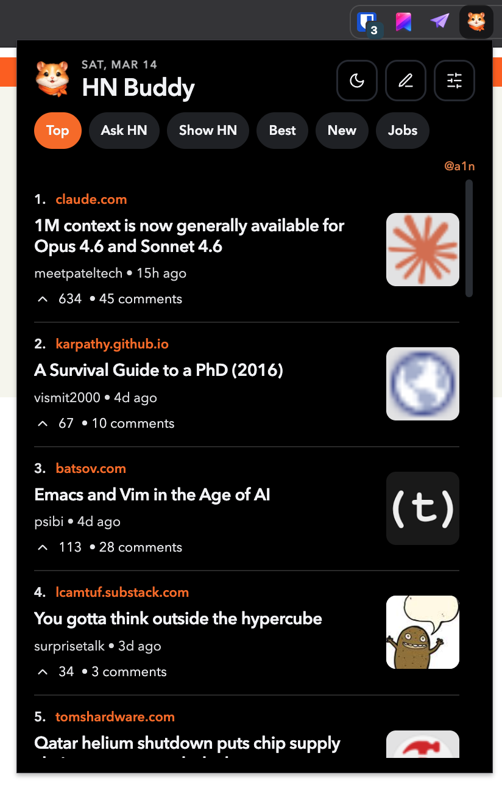

# HN Buddy Chrome Extension

A sleek Hacker News popup widget with feed tabs, story browsing, theme toggle, and in-popup discussion actions.

## Features
- Top, Ask HN, Show HN, Best, New, and Jobs feed tabs.
- Modern popup experience inspired by mobile/news widget cards.
- Dark/light mode with persisted preference (`chrome.storage.local`).
- Sign-in awareness (uses your existing `news.ycombinator.com` session cookie).
- Open comments in-popup and reply directly from the extension.
- Add top-level comments from popup.
- Create new posts from popup (link posts and Ask HN style text posts).

## Load locally in Chrome
1. Open `chrome://extensions`.
2. Enable **Developer mode**.
3. Click **Load unpacked**.
4. Select this project folder (the extension root you cloned/downloaded).

## Notes on authentication
- The extension does **not** handle HN credentials itself.
- Use the **Sign in** button to open HN login in a tab.
- After logging in, reopen the popup and refresh the feed.

## Permissions
- `storage`: theme + local state persistence.
- Host permissions:
  - `https://news.ycombinator.com/*` for auth-aware form actions.
  - `https://hacker-news.firebaseio.com/*` for feed + item reads.
